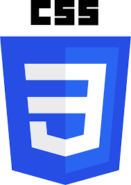
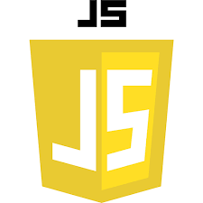
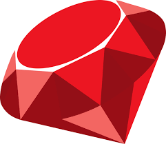
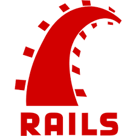
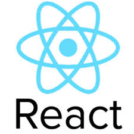
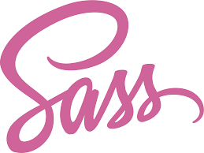
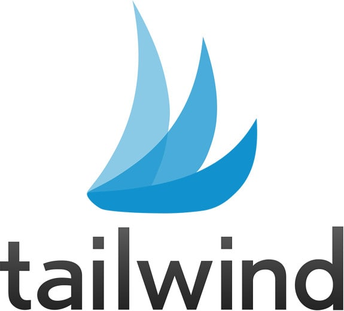
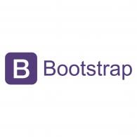

<h1 align=center> Hi there 👋 </h1>

### Welcome to my Github Account. 🙏

  <b>My name is Marios Kanellopoulos</b>  
  I am from Patras, Greece. 🇬🇷  
  At the moment, I am studying in Microverse, an online coding school  
  In my repositories you can find projects in different languages, libraries and frameworks like:

  

<!--
**mariosknl/mariosknl** is a ✨ _special_ ✨ repository because its `README.md` (this file) appears on your GitHub profile.

Here are some ideas to get you started:

- 🔭 I’m currently working on ...
- 🌱 I’m currently learning ...
- 👯 I’m looking to collaborate on ...
- 🤔 I’m looking for help with ...
- 💬 Ask me about ...
- 📫 How to reach me: ...
- 😄 Pronouns: ...
- ⚡ Fun fact: ...
-->
